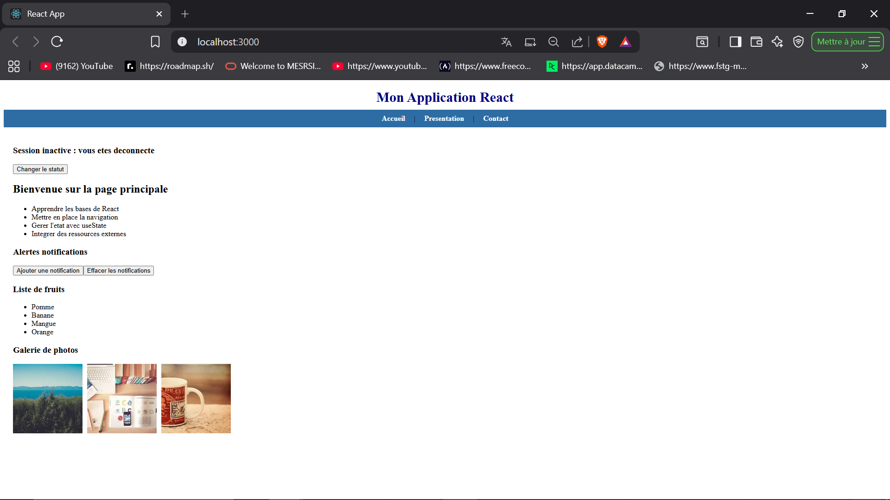
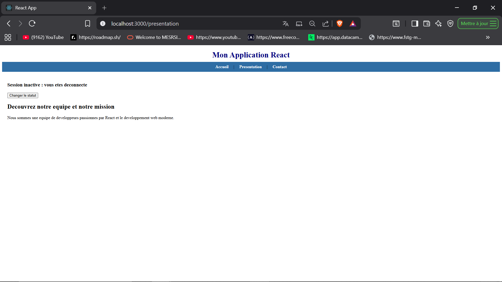
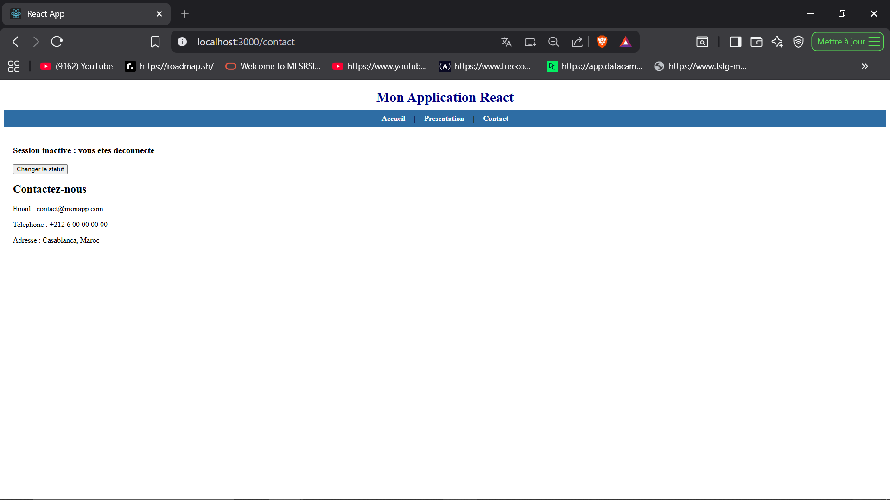

# TP 3 : Navigation, rendu conditionnel et integration des ressources dans React

## Description

Ce TP a pour objectif de mettre en pratique la navigation entre pages
avec React Router, le rendu conditionnel avec les operateurs ternaires
et logiques, l'iteration sur des tableaux avec map(), ainsi que
l'integration de styles CSS dans une application React.

---

## Technologies utilisees

- React (via Create React App)
- JavaScript ES6
- JSX
- React Router DOM
- CSS
- PropTypes

---

## Structure du projet

src/
├── App.js
├── App.css
├── index.js
├── PagePrincipale.js
├── PagePresentation.js
├── PageContact.js
├── StatutSession.js
├── ListeActivites.js
├── NotificationsAlerte.js
├── ListePersonnalisee.js
├── GaleriePhotos.js

---

## Composants realises

### PagePrincipale
Page d'accueil de l'application. Elle regroupe les composants
ListeActivites, NotificationsAlerte, ListePersonnalisee et
GaleriePhotos.

### PagePresentation
Page secondaire accessible via la barre de navigation. Elle affiche
une description de l'equipe et de la mission du projet.

### PageContact
Page supplementaire contenant les informations de contact. Elle est
accessible via un lien dans la barre de navigation.

### StatutSession
Composant de rendu conditionnel qui affiche "Session active" ou
"Session inactive" selon un etat booleen gere par useState. Un bouton
permet de basculer entre les deux etats.

### ListeActivites
Composant qui affiche dynamiquement une liste d'activites en utilisant
la methode map() sur un tableau de donnees locales.

### NotificationsAlerte
Exercice 1 : affiche un message uniquement si le nombre de notifications
est superieur a zero, en utilisant l'operateur logique &&. Deux boutons
permettent d'ajouter ou d'effacer les notifications.

### ListePersonnalisee
Exercice 2 : composant generique qui recoit un tableau en props et
l'affiche sous forme de liste avec map(). La validation des props est
assuree par PropTypes.

### GaleriePhotos
Exercice 3 : composant qui affiche trois photos cote a cote en utilisant
map() sur un tableau d'objets contenant des URLs d'images externes.

---

## Methodes utilisees

**React Router DOM :** la bibliotheque react-router-dom est utilisee
pour mettre en place une navigation de type Single Page Application.
BrowserRouter encapsule l'application, Routes et Route definissent
les chemins, et Link cree des liens internes sans rechargement de page.

**Rendu conditionnel :** deux techniques sont utilisees. L'operateur
ternaire condition ? siVrai : siFaux dans StatutSession pour afficher
un message selon l'etat, et l'operateur logique && dans
NotificationsAlerte pour afficher un element uniquement si une
condition est vraie.

**Iteration avec map() :** la methode JavaScript map() est utilisee
dans ListeActivites, ListePersonnalisee et GaleriePhotos pour generer
dynamiquement des elements JSX a partir de tableaux de donnees.
La propriete key est definie pour chaque element afin d'optimiser
le rendu.

**Styles CSS :** un fichier App.css est importe dans App.js. Les
classes sont appliquees avec className au lieu de class pour respecter
la syntaxe JSX. Des styles sont egalement appliques directement via
l'attribut style dans certains composants.

---

## Resultats obtenus

- Acceuil

- Presentation

- Contact

---

## Lancer le projet

npm install
npm start

L'application sera accessible a l'adresse : http://localhost:3000